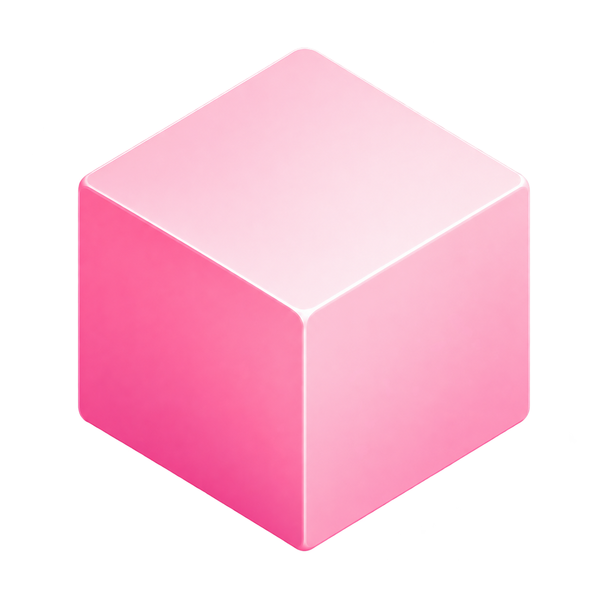

# Cubo Works

### Don't be square. Build with Cubo.

We build custom software for businesses and create our own digital products.

[Website](https://www.cuboworks.com)

---

## What we do

We design and build software for companies that need solutions tailored to the way they work.

Our work includes:

- Custom business systems
- Web applications
- SaaS platforms
- APIs and backend services
- Workflow automation
- AI-powered solutions
- Internal tools
- Digital products

We also create and operate our own products under the **Cubo Works** ecosystem.

---

## Products

### Stock Information

Financial market information and intelligence platform currently under development.

`In Development`

More products are coming.

---

## How we build

We care about simple architecture, maintainable code and products that solve real problems.

Our development workflow is based on:

`Issues` · `Branches` · `Pull Requests` · `Code Review` · `Testing` · `Documentation` · `CI/CD`

---

### Have something to build?

**Let's build it with Cubo.**

[www.cuboworks.com](https://www.cuboworks.com)

 

**Don't be square. Build with Cubo.**

